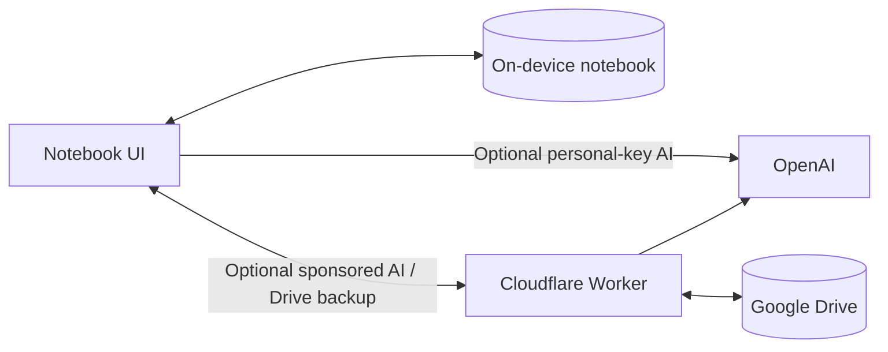

# AhThatsWho

**You remember the dog. The red bike. Their entire kitchen renovation. Their name? Absolutely not.**

AhThatsWho is a personal name notebook for those “I know you…” moments. Save a name and a small detail after meeting someone. Next time you meet, find the name using whatever stuck—or browse the people you know from that setting until something clicks.

**No account. No login. Your notebook lives on your device.** Add, browse, search, and edit entirely locally—even offline. AI and cloud backups are optional extras.

## Less “sorry, what was your name again?”

- **Search for what you remember.** “Red bike” can be enough to find Anna, Leo’s mum. Partial names, details, and typos all work.
- **No search term? Just browse.** Pick a context, such as school, work, or a club, and scroll a scannable list of people and households. Sometimes recognition gets there before recall.
- **Get it down while it’s fresh.** Add a person manually, jot a note, or speak it. Optional AI turns a note about one or several households into entries you review before saving.
- **Put a face to the name.** Add a cropped portrait to a person, including from a group photo. Images stay on your device unless you choose Drive backup or export a backup file.
- **Keep the connections.** People appear together in households, with the details and contexts that help you place them.
- **Skip the signup ceremony.** No account, login, or API key required. The core notebook works fully locally, with offline browsing, search, and editing. Use optional AI or cloud backup only when you choose.

The idea is simple: a quick note now, a quick glance later, and slightly less inventive use of “heyyy, you!”

## Try it

Open [AhThatsWho](https://ahthatswho.com) and choose **Add a person** or **Speak or jot a note**. Installation help is on the welcome screen and in Settings. The [user guide](docs/user-guide.md) covers browsing, capture, and recovery.

AI is sponsored by default, with an optional personal API key. When you request processing, relevant recordings, text, and notebook details go to OpenAI; sponsored requests pass through our server. Read the [privacy policy](https://ahthatswho.com/privacy/) for details.

**Status:** beta candidate. The [verification record](docs/verification.md) tracks completed checks and pending live-provider and installed-iPhone validation.

For help or feedback, email [hello@ahthatswho.com](mailto:hello@ahthatswho.com).

## How it works

A SolidStart/Solid app stores notebook text locally in IndexedDB through Dexie and cropped portraits separately in OPFS. A service worker supports offline use. Cloudflare serves the static app and a Worker handles sponsored AI and optional Google Drive backup; personal-key AI connects directly to OpenAI.

AI suggests changes; you review them before anything is saved. Cloud backups are snapshots for recovery. Each installation keeps its own notebook, without device synchronization.

For local setup, checks, and implementation details, see the [development guide](docs/development.md). Service configuration lives in [deployment](docs/deployment.md) and [Google Drive setup](docs/google-drive-setup.md).

## License

[MIT](LICENSE). Bundled fonts retain their [SIL Open Font Licenses](src/assets/fonts/); dependencies retain their respective licenses.
